# Mindemo3D

[English](README.en.md) &nbsp;&nbsp;&nbsp;&nbsp;&nbsp; [Japanese](README.jp.md)

## Overview
This program visualizes a three-dimensional probability distribution constructed using the [Minimum Information Dependence Model](https://arxiv.org/abs/2206.06792) ([arXiv](https://arxiv.org/abs/2206.06792), [GitHub](https://github.com/kyanostat/min-info)).

## Example of Program Usage
Check out the [example of program usage](https://tanaken-basis.github.io/mindemo3d/) to see how it works.

[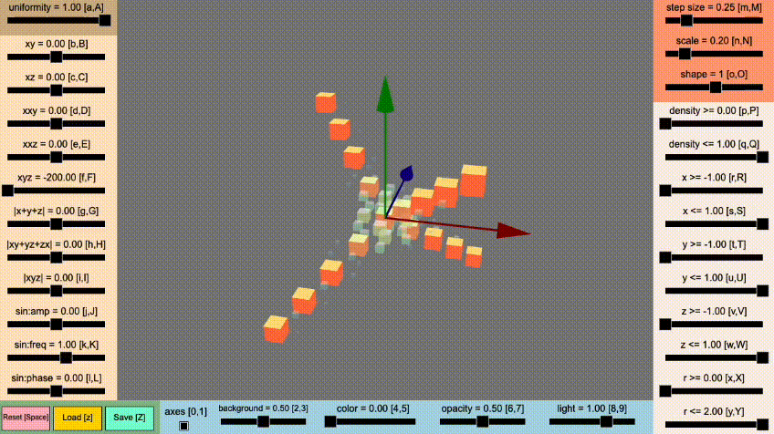](https://tanaken-basis.github.io/mindemo3d/)

Note that this web application only uses a web browser as an interface and is actually running locally.
No information should be sent to external servers when using this web app.

## Description of the Web Application

This section explains how to view and operate the web application. The web application consists of a part that draws probability functions, as shown in the image below, and sliders and other controls for setting them.

[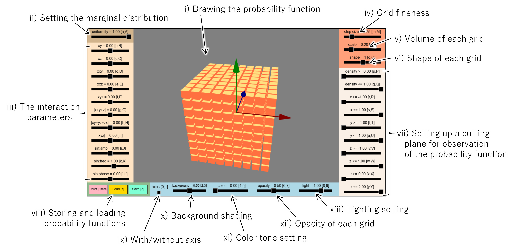](https://tanaken-basis.github.io/mindemo3d/)

- i) : Display section for Drawing Probability Functions<br />

  The probability function generated by the [Minimum Information Dependence Model (Mindemo)](https://arxiv.org/abs/2206.06792) in three dimensions is drawn in this display section. The 3D space is divided into grids with a width set in iv), within the range of $ -1 \leq x, y, z \leq 1 $, and the value of the probability function at each position is calculated. The larger the value of the probability function in a grid, the larger the size of the object (such as a cube) in that grid, and the higher its opacity. Additionally, the color of the objects changes according to the value of the probability function. The $x$-axis is represented by a red arrow, the $y$-axis by a green arrow, and the $z$-axis by a blue arrow.

  You can perform the following actions to manipulate the camera:

  - Rotation: Hold down the left mouse button and move the mouse.
  - Zoom In/Out: Rotate the mouse wheel.
  - Pan (Parallel Movement): Hold down the right mouse button and move the mouse.

  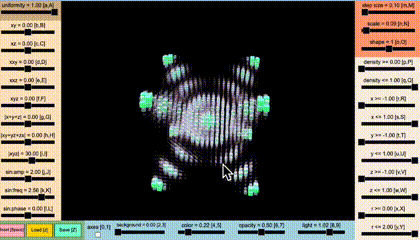

- ii) - iii) : Sliders for Setting Probability Functions<br />

  For [Minimum Information Dependence Model (Mindemo)](https://arxiv.org/abs/2206.06792) in three dimensions, it is generally expressed as:
  
  $p(x, y, z; \theta, \nu) =
  \exp\{\theta^{\top}h(x,y,z)
  -(a_{x}(x;\theta,\nu)+a_{y}(y;\theta,\nu)+a_{z}(z;\theta,\nu))
  -\psi(\theta,\nu)\}
  \cdot r_{x}(x;\nu) \cdot r_{y}(y;\nu) \cdot r_{z}(z;\nu)$

  Among these terms, $a_{x}(x;\theta,\nu)$, $a_{y}(y;\theta,\nu)$, $a_{z}(z;\theta,\nu)$, and $\psi(\theta,\nu)$ are essentially determined automatically. Therefore, by setting $\theta^{\top}h(x,y,z)$ and $r_{x}(x;\nu)$, $r_{y}(y;\nu)$, $r_{z}(z;\nu)$, the probability distribution is determined.

  First, $r_{x}(x;\nu)$, $r_{y}(y;\nu)$ and $r_{z}(z;\nu)$ represent the marginal distribution, and basically, any probability distribution is acceptable. In this web application, you can set a mixture distribution of a uniform distribution and a normal distribution (discretized within the range of -1 to 1, with a mean of approximately 0 and a variance of approximately 0.29). The slider in ii) is used to set the mixing ratio.

  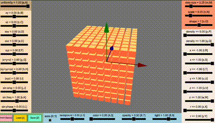

  You can also manipulate the slider values using your keyboard. For instance, in the “Uniformity” section, the notation [a, A] indicates that pressing “a” decreases the slider value, while pressing “A” increases it.

  The slider in iii) allows you to set the term $\theta^{\top}h(x,y,z)$. The term $\theta^{\top}h(x,y,z)$ can represent interactions. 
  
  For example, the “xy” slider sets the value of $\theta_{xy}$, assuming there is an interaction term $\theta_{xy} \cdot x y$ within  $\theta^{\top}h(x,y,z)$. When there is a constraint that the marginal distribution is a uniform distribution, increasing the value of $\theta_{xy}$ concentrates the probability around the region where $x=y$.

  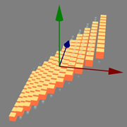
  

  The “|xyz|” slider sets the value of $\theta_{|xyz|}$, assuming there is an interaction term $\theta_{|xyz|} \cdot |x y z|$ within  $\theta^{\top}h(x,y,z)$. When there is a constraint that the marginal distribution is a uniform distribution, increasing the value of $\theta_{|xyz|}$ concentrates the probability around the region where $|x|=|y|=|z|$.

  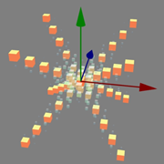

  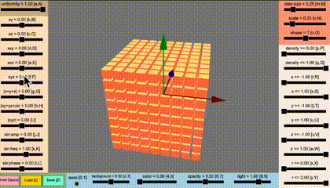

  Additionally, the three parameters “sin:amp”, “sin:freq” and “sin;phase” correspond to the values $A$, $\phi$ and $\psi$, respectively, assuming there is a term $A\cdot \sin(2\pi (\phi\cdot\sqrt{x^2+y^2+z^2} + \psi))$ within $\theta^{\top}h(x,y,z)$.

  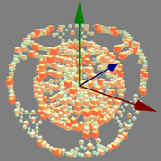

  

  When you adjust both the “xyz” slider and the “sin” sliders, you can generate a probability function that looks something like the image below:

  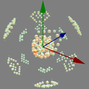

  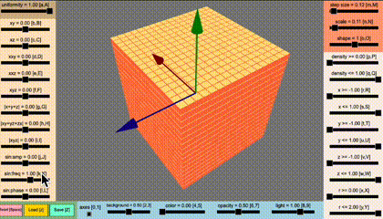

- iv) - vi): Slider for Grid Configuration

  In iv), you can set the width of the grid. The initial value is set to 0.25, which corresponds to calculating the values of the probability function at 729 positions (assuming a 9×9×9 grid). However, if you set the grid width to 0.1, you’ll need to compute the values for 9261 positions (a 21×21×21 grid), which could significantly slow down the operation.

  

  The v) slider allows you to set the size of each object within the grid.

  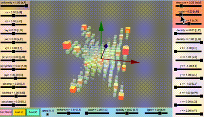

  The vi) slider lets you configure the shape of each object within the grid. You can choose not only cubes (shape=1) but also other shapes like cylinders (shape=2), spheres (shape=20), or toroids (shape=25). You can also configure settings where the shape of each object within the grid is randomly selected or varies based on the values of the probability function.
  
  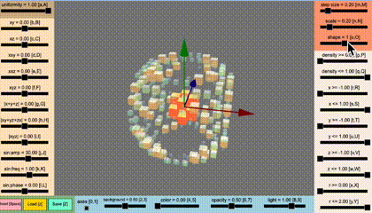

  If you set the “shape” value to a negative value, the object size will no longer depend on the values of the probability function.

- vii) Sliders for Viewing Probability Function Cross-Sections

  There are sliders for setting cross-sections to observe the probability function. For example, if you set it to “x <= 0”, the part of the function where $x > 0$ temporarily becomes invisible, allowing you to observe the cross-section at $x = 0$.

  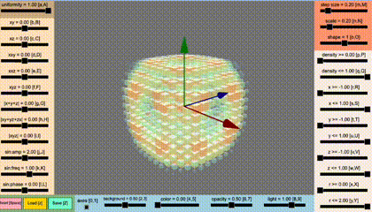

- viii) Buttons for Resetting, Saving, and Loading the Probability Function

  You’ll find buttons that allow you to reset the probability function settings and perform actions like saving and loading.

- ix) - xiii): Sliders and Checkbox for Visual Settings

  ix): This checkbox allows you to toggle the presence of axes.
  
  

  x): The slider for adjusting background intensity. You can make it 
  completely white or pitch black.
  
  

  xi): A slider for configuring the color tone of objects.

  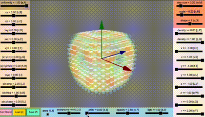

  xii): Adjusts the opacity of objects. Setting it all the way to the right makes them completely opaque.

  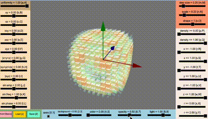

  xiii): A slider for adjusting light strength and position. Moving it all the way to the left reduces the effect of the light, but it won’t make things invisible.

  

## Installation and Execution

### Prerequisites
Before installing and running the program on your local machine, make sure you have [Node.js](https://nodejs.org/) installed.

### Installation
First, clone the repository to your local machine. You can do this by running the following command in your terminal or by downloading the zip file from [here](https://github.com/tanaken-basis/mindemo3d):
```sh
git clone https://github.com/tanaken-basis/mindemo3d.git
```

Navigate to the project directory:
```sh
cd mindemo3d
```

Install the required libraries:
```sh
npm install
```

### Execution
To run the program, enter the following command in your terminal. Access the web app by opening your browser and navigating to http://localhost:5173/ (note that the port number may differ):
```sh
npm start
```

## About Mindemo
Mindemo stands for [“Minimum Information Dependence Model”](https://github.com/kyanostat/min-info) ([arXiv](https://arxiv.org/abs/2206.06792), [GitHub](https://github.com/kyanostat/min-info)). It is a highly flexible model capable of handling various interactions. In this program, we calculate probability functions using the Sinkhorn-Knopp algorithm for optimal transport based on the descriptions in the [Minimum Information Dependence Model](https://arxiv.org/abs/2206.06792) paper. For models with dimensions higher than three, we implement the Sinkhorn-Knopp algorithm for multi-marginal optimal transport. Keep in mind that running the Sinkhorn-Knopp algorithm for parameter updates can be computationally intensive. Additionally, setting the step size too small may lead to convergence issues.

## About Mindemo2D
We’ve also prepared a Python program called [Mindemo2D](https://github.com/tanaken-basis/mindemo2d) that visualizes a two-dimensional probability distribution constructed using the [Minimum Information Dependence Model](https://arxiv.org/abs/2206.06792) ([arXiv](https://arxiv.org/abs/2206.06792), [GitHub](https://github.com/kyanostat/min-info)). This version allows for more detailed parameter settings related to the probability distribution. 

## Libraries Used
This program utilizes Babylon.js for three-dimensional rendering and Tone.js for generating and playing audio effects.

## Gallery

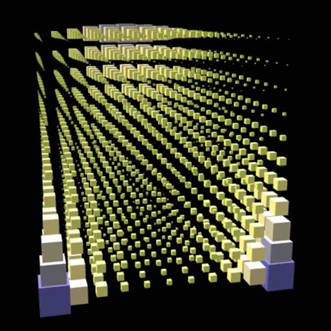
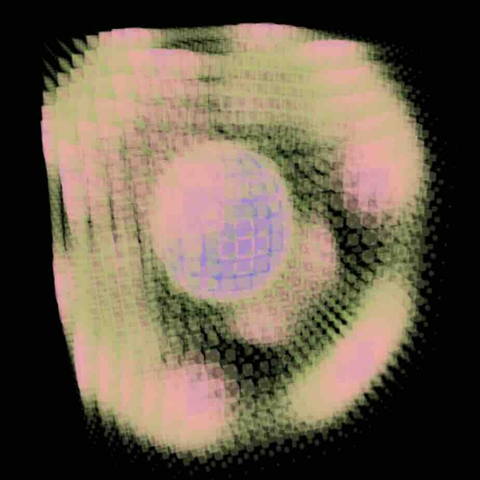
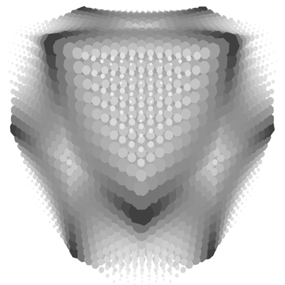
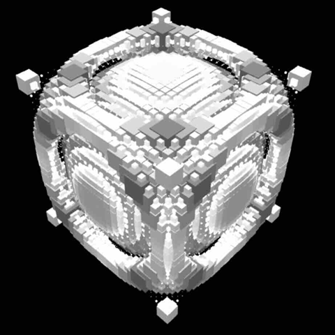
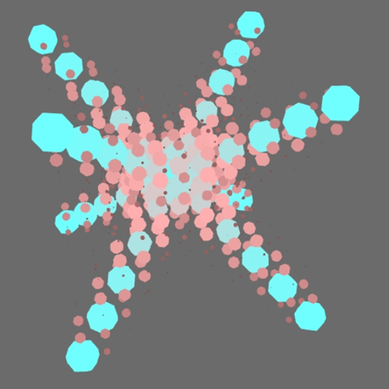
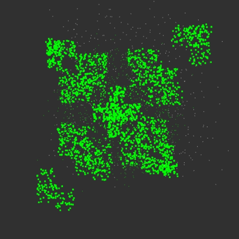
