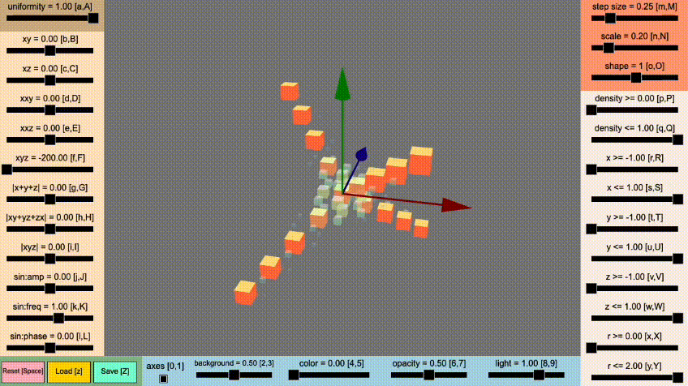
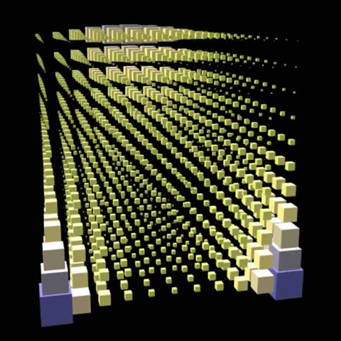
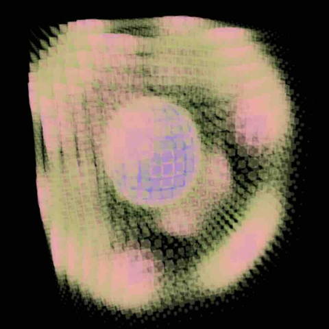
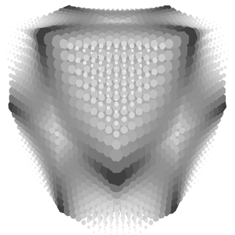
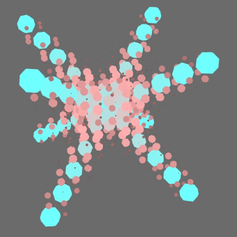
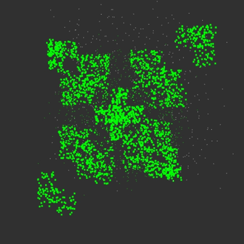

# Mindemo3D

[English](README.en.md) &nbsp;&nbsp;&nbsp;&nbsp;&nbsp; [Japanese](README.jp.md)

## Overview
This program visualizes a three-dimensional probability distribution constructed using the [Minimum Information Dependence Model](https://arxiv.org/abs/2206.06792).

## Example of Program Usage
Check out the [example of program usage](https://tanaken-basis.github.io/mindemo3d/) to see how it works.



## Installation and Execution

### Prerequisites
Before installing and running the program on your local machine, make sure you have [Node.js](https://nodejs.org/) installed.

### Installation
First, clone the repository to your local machine. You can do this by running the following command in your terminal or by downloading the zip file from [here](https://github.com/tanaken-basis/mindemo3d):
```sh
git clone https://github.com/tanaken-basis/mindemo3d.git
```

Navigate to the project directory:
```sh
cd mindemo3d
```

Install the required libraries:
```sh
npm install
```

### Execution
To run the program, enter the following command in your terminal. Access the web app by opening your browser and navigating to http://localhost:5173/ (note that the port number may differ):
```sh
npm start
```

## About Mindemo
Mindemo stands for [“Minimum Information Dependence Model”](https://github.com/kyanostat/min-info). It is a highly flexible model capable of handling various interactions. In this program, we calculate probability functions using the Sinkhorn-Knopp algorithm for optimal transport based on the descriptions in the [Minimum Information Dependence Model](https://arxiv.org/abs/2206.06792) paper. For models with dimensions higher than three, we implement the Sinkhorn-Knopp algorithm for multi-marginal optimal transport. Keep in mind that running the Sinkhorn-Knopp algorithm for parameter updates can be computationally intensive. Additionally, setting the step size too small may lead to convergence issues.

## About Mindemo2D
We’ve also prepared a Python program called [Mindemo2D](https://tanaken-basis.github.io/mindemo2d/) that visualizes a two-dimensional probability distribution constructed using the [Minimum Information Dependence Model](https://arxiv.org/abs/2206.06792). This version allows for more detailed parameter settings related to the probability distribution. 

## Libraries Used
This program utilizes Babylon.js for three-dimensional rendering and Tone.js for generating and playing audio effects.

## Gallery







