# Mindemo3D

[English](README.en.md) &nbsp;&nbsp;&nbsp;&nbsp;&nbsp; [日本語](README.jp.md)

## 概要

[最小情報従属モデル](https://arxiv.org/abs/2206.06792)(Mindemo)を用いて構成した3次元の確率分布を可視化するプログラムです。

## プログラムの使用例

[プログラムの使用例](https://tanaken-basis.github.io/mindemo3d/)をご覧ください。

[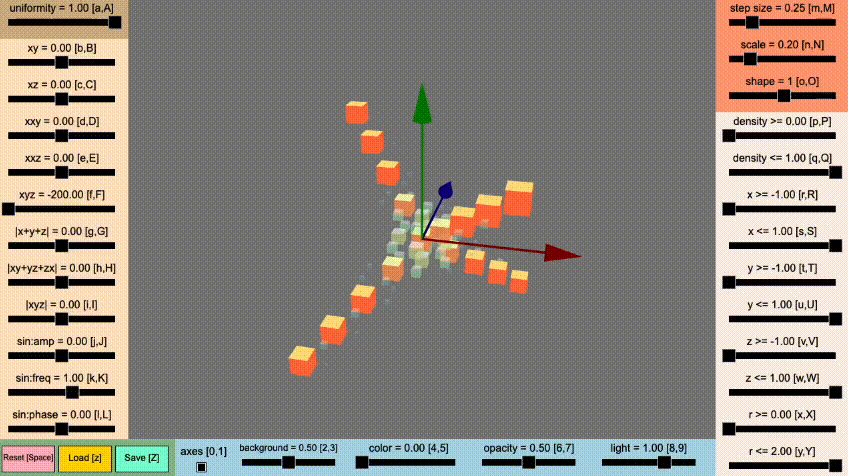](https://tanaken-basis.github.io/mindemo3d/)

なお、このWebアプリは、インターフェイスとしてWebブラウザを使用しているだけで、実際にはローカルで動作しています。
このWebアプリを使用しても、外部への情報の送信などは行われないはずです。

## Webアプリの説明

[Webアプリ](https://tanaken-basis.github.io/mindemo3d/)の見方と動かし方について説明します。
Webアプリは、以下の画像のように、確率関数を描画する部分と、その設定のためのスライダーなどで構成されています。

[](https://tanaken-basis.github.io/mindemo3d/)

- i) : 確率関数を描画する部分<br />
  3次元の場合の[最小情報従属モデル](https://arxiv.org/abs/2206.06792)(Mindemo)により生成される確率関数を描画します。
  $ -1 \leq x, y, z \leq 1 $ の範囲で、 iv) で設定したグリッド幅で３次元空間を分割して、それぞれの位置の確率関数の値を計算しています。
  確率関数の値が大きいグリッドほど、そこのオブジェクト(立方体など)の大きさが大きくなり、不透明度も高くなります。
  また、確率関数の値に応じてオブジェクトの色も変化します。
  なお、$x$軸は赤い矢印、$y$軸は緑の矢印、$z$軸は青い矢印で表されています。

  以下の操作でカメラの回転, 拡大・縮小, 平行移動ができます。 
    - 回転: マウスの左ボタンを押しながらマウスを動かす。
    - 拡大・縮小: マウスのホイールを回す。
    - 平行移動: マウスの右ボタンを押しながらマウスを動かす。

  

- ii) - iii) : 確率関数の設定をするスライダー<br />

  3次元の場合の[最小情報従属モデル](https://arxiv.org/abs/2206.06792)(Mindemo)は、一般的には、

  $p(x, y, z; \theta, \nu) =
  \exp\{\theta^{\top}h(x,y,z)
  -(a_{x}(x;\theta,\nu)+a_{y}(y;\theta,\nu)+a_{z}(z;\theta,\nu))
  -\psi(\theta,\nu)\}
  \cdot r_{x}(x;\nu) \cdot r_{y}(y;\nu) \cdot r_{z}(z;\nu)$
  
  のように表されます。
  これらの項の中で、$a_{x}(x;\theta,\nu)$, $a_{y}(y;\theta,\nu)$, $a_{z}(z;\theta,\nu)$ と $\psi(\theta,\nu)$ は、基本的に、自動的に決定される部分になります。そのため、
  $\theta^{\top}h(x,y,z)$
  と
  $r_{x}(x;\nu)$, $r_{y}(y;\nu)$, $r_{z}(z;\nu)$
  を設定すれば、確率分布が決まることになります。

  まず、$r_{x}(x;\nu)$, $r_{y}(y;\nu)$, $r_{z}(z;\nu)$ の部分は、周辺分布を表しており、基本的にはどんな確率分布でもOKです。このWebアプリでは、一様分布と正規分布(-1から1までの範囲で正規分布(平均は大体0くらい, 分散は大体0.29くらい)を離散化したもの)の混合分布を設定できるようにしています。ii)のスライダーでその混合比を設定しています。

  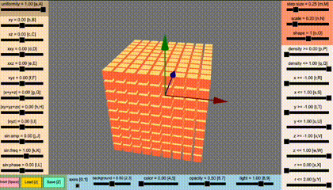

  スライダーの値などは、キーボードでも操作できます。
  例えば、Uniformityのところに書いてある [a, A] は、aを押すとスライダーの値が小さくなり、Aを押すとスライダーの値が大きくなる、ということを表します。

  iii)のスライダーでは、$\theta^{\top}h(x,y,z)$ の部分を設定できるようにしています。$\theta^{\top}h(x,y,z)$は、交互作用を表現することができる部分です。

  例えば、“xy” のスライダーは、 $\theta^{\top}h(x,y,z)$ の中に $\theta_{xy} \cdot x y$ という $x$ と $y$ の交互作用があるとして、 $\theta_{xy}$ の値を設定しています。
  周辺分布が一様分布という制約がある場合には、$\theta_{xy}$の値を大きくすると、 $x=y$ の領域付近に確率が集中します。

  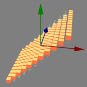

  

  “|xyz|” のスライダーは、 $\theta^{\top}h(x,y,z)$ の中に $\theta_{|xyz|} \cdot |x y z|$ という交互作用があるとして、 $\theta_{|xyz|}$ の値を設定しています。
  周辺分布が一様分布という制約がある場合には、$\theta_{|xyz|}$の値を大きくすると、 $|x|=|y|=|z|$ の領域付近に確率が集中します。

  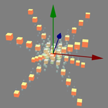

  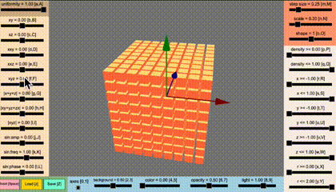

  また、“sin:amp”, “sin:freq”, “sin;phase” の３つは、
  $\theta^{\top}h(x,y,z)$ の中に
  $A\cdot \sin(2\pi (\phi\cdot\sqrt{x^2+y^2+z^2} + \psi))$
  という項があるとして、それぞれ、$A$, $\phi$, $\psi$ の値に対応しています。

  
  
  

  "xyz"のスライダーと"sin"のスライダーを両方動かすと、例えば、以下の画像のような確率関数を生成することができます。

  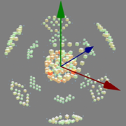
  

- iv) - vi) : グリッドの設定をするスライダー<br />

  iv) "step size" でグリッドの幅を設定できます。初期値は 0.25 に設定されており、この場合、$9^3=729$個の位置の確率関数の値を計算しています。もし、グリッドの幅を 0.1 に設定すると、$21^3=9261$個の確率関数の値を計算することになり、動作がとても遅くなる可能性があります。

  

  v) "scale" は、各グリッドのオブジェクトの大きさを設定するスライダーです。

  

  vi) "shape" は、各グリッドのオブジェクトの形状を設定するスライダーです。初期値(shape=1)の立方体だけでなく、円柱(shape=2)や球(shape=20)やドーナツ型(shape=25)なども選択できます。各グリッドのオブジェクトの形状がランダムに選択されるようにしたり、確率関数の値に応じて形状を変化させるような設定も選択できます。 

  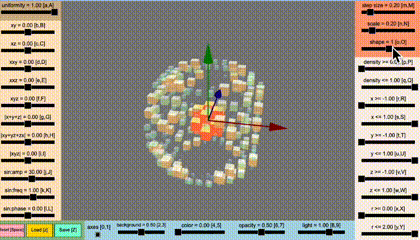

  なお、"shape"の値を負の値に設定すると、オブジェクトの大きさが確率関数の値に依存しなくなります。

- vii) : 確率関数の観察のための切断面を設定するスライダー<br />

  確率関数の中を覗くための切断面を設定するスライダーがあります。
  例えば、“x <= 0” のように設定すると、$x > 0$の部分が一時的に見えなくなるため、
  $x=0$ の切断面が観察できます。

  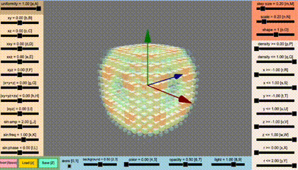

- viii) : 確率関数のリセットと保存と読み込みをするボタン<br />

  確率関数の設定をリセットしたりできるボタンなどがあります。

- ix) - xiii) : 見映えの設定をするスライダーとチェックボックス<br />

  ix) は、軸の有り無しを設定するチェックボックスです。

  

  x) は、背景の濃さを設定するスライダーで、真っ白にしたり真っ黒にしたりできます。

  

  xi) は、オブジェクトの色調を設定するスライダーです。

  

  xii) は、オブジェクトの不透明度を設定するスライダーです。
  一番右に設定すると、完全に不透明になります。

  

  xiii) は、ライトの強さや位置などを設定するスライダーです。
  一番左に設定すると、ライトの効果が無くなりますが見えなくなるわけではありません。

  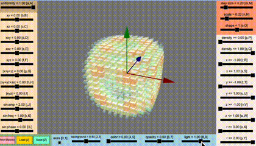

## インストールと実行方法

### インストールの前に

ローカルマシンでのインストールと実行には、[Node.js](https://nodejs.org/)が必要です。

### インストール

まず、リポジトリをローカルマシンにクローンします。
ターミナルで以下のように実行するか、または、[ここ](https://github.com/tanaken-basis/mindemo3d)からzipファイルをダウンロードして展開します。
```sh
git clone https://github.com/tanaken-basis/mindemo3d.git
```

次に、プロジェクトのディレクトリに移動します。
```sh
cd mindemo3d
```

ライブラリのインストールをします。
```sh
npm install
```

### 実行方法

ターミナルで以下のように入力して、ブラウザで http://localhost:5173/ （ポート番号は5173とは違う場合もあります）にアクセスするとWebアプリが起動します。
```sh
npm start
```

## Mindemoについて

Mindemoは、[最小情報従属モデル (Minimum Information Dependence Model)](https://github.com/kyanostat/min-info) ([arXiv](https://arxiv.org/abs/2206.06792), [GitHub](https://github.com/kyanostat/min-info)) の略称です。Mindemoは、様々な交互作用を取り扱うことができる非常に柔軟性の高いモデルです。このプログラムでは、[最小情報従属モデルの論文](https://arxiv.org/abs/2206.06792)における記述をもとに、最適輸送における Sinkhorn-Knopp アルゴリズムを用いて確率関数を計算しています。なお、3次元以上のモデルにおいては、multi-marginal optimal transport に対する Sinkhorn-Knopp アルゴリズム が必要になり、このプログラムにおいてもその実装を行っています。確率関数のパラメーターの値を更新するたびに Sinkhorn-Knopp アルゴリズムを実行しているので、それなりに計算時間がかかります。また、ステップサイズを小さくしすぎると計算できなくなるかもしれません。

## Mindemo2Dについて

[最小情報従属モデル](https://arxiv.org/abs/2206.06792) ([arXiv](https://arxiv.org/abs/2206.06792), [GitHub](https://github.com/kyanostat/min-info)) を用いて構成した2次元の確率分布を可視化する [Mindemo2D](https://github.com/tanaken-basis/mindemo2d) という名前のPythonのプログラムを[こちら](https://github.com/tanaken-basis/mindemo2d)に用意しています。確率分布のパラメータについては、こちらのほうがより細かく設定できます。

## ライブラリーについて

このプログラムでは、３次元の描画のために[Babylon.js](https://github.com/BabylonJS/Babylon.js)を用いています。また、効果音の生成・再生のために[Tone.js](https://github.com/Tonejs/Tone.js)を用いています。

## ギャラリー


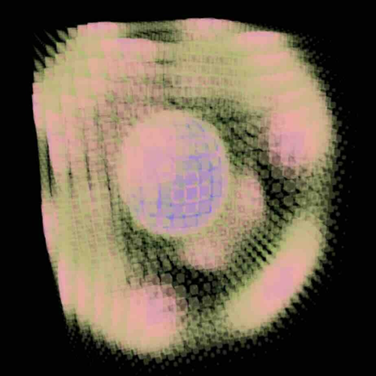


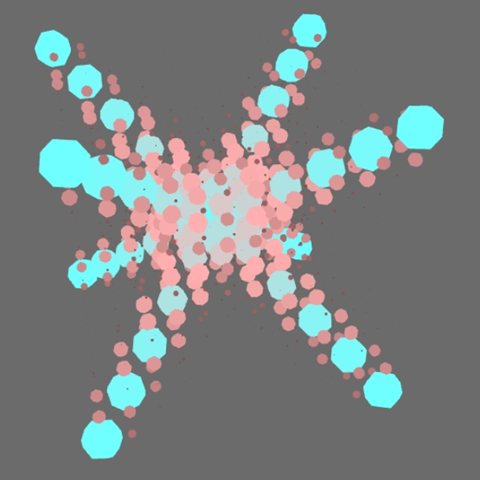
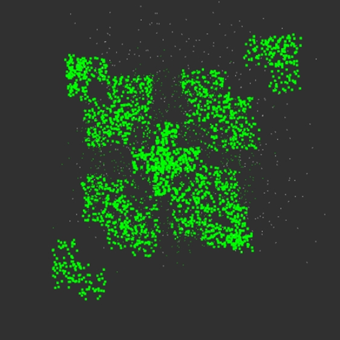
