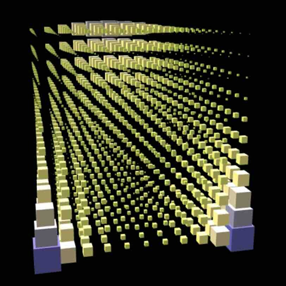

# Mindemo3D

[English](README.en.md) &nbsp;&nbsp;&nbsp;&nbsp;&nbsp; [日本語](README.jp.md)

## 概要

[最小情報従属モデル](https://arxiv.org/abs/2206.06792)(Mindemo)を用いて構成した3次元の確率分布を可視化するプログラムです。

## プログラムの使用例

[プログラムの使用例](https://tanaken-basis.github.io/mindemo3d/)をご覧ください。


## インストールと実行方法

### インストールの前に

ローカルマシンでのインストールと実行には、[Node.js](https://nodejs.org/)が必要です。

### インストール

まず、リポジトリをローカルマシンにクローンします。
ターミナルで以下のように実行するか、または、[ここ](https://github.com/tanaken-basis/mindemo3d)からzipファイルをダウンロードして展開します。
```sh
git clone https://github.com/tanaken-basis/mindemo3d.git
```

次に、プロジェクトのディレクトリに移動します。
```sh
cd mindemo3d
```

ライブラリのインストールをします。
```sh
npm install
```

### 実行方法

ターミナルで以下のように入力して、ブラウザで http://localhost:5173/ （ポート番号は5173とは違う場合もあります）にアクセスするとWebアプリが起動します。
```sh
npm start
```

## Mindemoについて

Mindemoは、[最小情報従属モデル(Minimum Information Dependence Model)](https://github.com/kyanostat/min-info)の略称です。Mindemoは、様々な交互作用を取り扱うことができる非常に柔軟性の高いモデルです。このプログラムでは、[最小情報従属モデルの論文](https://arxiv.org/abs/2206.06792)における記述をもとに、最適輸送における Sinkhorn-Knopp アルゴリズムを用いて確率関数を計算しています。なお、3次元以上のモデルにおいては、multi-marginal optimal transport に対する Sinkhorn-Knopp アルゴリズム が必要になり、このプログラムにおいてもその実装を行っています。確率関数のパラメーターの値を更新するたびに Sinkhorn-Knopp アルゴリズムを実行しているので、それなりに計算時間がかかります。また、ステップサイズを小さくしすぎると計算できなくなるかもしれません。

## Mindemo2Dについて

[最小情報従属モデル](https://arxiv.org/abs/2206.06792)を用いて構成した2次元の確率分布を可視化する[Mindemo2D](https://tanaken-basis.github.io/mindemo2d/)という名前のPythonのプログラムを[こちら](https://tanaken-basis.github.io/mindemo2d/)に用意しています。確率分布のパラメータについては、こちらのほうがより細かく設定できます。

## ライブラリーについて

このプログラムでは、３次元の描画のために[Babylon.js](https://github.com/BabylonJS/Babylon.js)を用いています。また、効果音の生成・再生のために[Tone.js](https://github.com/Tonejs/Tone.js)を用いています。

## ギャラリー




